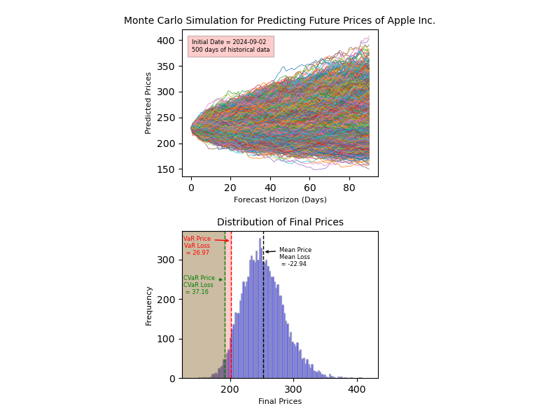

# Monte Carlo Simulation on Financial Data Forecasting Future Prices
## Project Description

This project involves implementing Monte Carlo simulation on financial data fetched from Yahoo Finance. The aim is to apply Monte Carlo method by introducing random variables, assuming a normal distribution for returns, to predict future adjusted closing prices for the provided company. For this purpose, the company's historical data for the specified period will be used, to illustrate the possible trajectories of future prices, considering daily compounding. Moreover, VaR (Value at Risk), CVaR (Conditional Value at Risk), and average losses of potential final prices are calculated. This enables financial investors and risk analysts to gain insights into potential scenarios and make informed decisions.

## Download Input Data

This project utilizes yfinance package to fetch financial data for the selected company. For more information see [this link](https://pypi.org/project/yfinance/).
There are two options to acquire data from yfinance:
1. using ```yfinance.download(symbol, ...)``` by using ```data_download()``` method of ```class DataLoader``` in data_loader.py file.
2. using ```yfinance.Ticker(symbol).history(...)``` by using ```data_history()``` method of ```class DataLoader``` in data_loader.py file.
The default code uses the first option, but you can tweak the initialization of the ```class Statistic``` in statistic.py file to use the second option.
If you choose the second option make sure to set ```auto_adjust=False``` to easily distinguish between 'Close' and 'Adj Close' columns. If using the default setting or ```auto_adjust=True```, then the 'Close' column in this case corrosponds to adjusted close prices.

## Setup

**Requirements**

Install the required packages:

```python
pip install -r requirements.txt
```

## Usage

### **Run Inference:**

Run the script below following the argument structure:

```python
python main.py [OPTIONS]
```
**Arguments:**
- ```--asset <"symbol">``` (Optional):
    - Enter the symbol of the company whose financial data will be analyzed
    - Format: check [this website](https://finance.yahoo.com/lookup/) to look up symbols.
    - Type: ```str```
    - Default: 'AAPL'
- ```--forecast_horizon <days>``` (Optional):
    - The number of days into the future, following the ```initial_date```, for which predictions will be made.
    - Type: ```int```
    - Default: 90
- ```--initial_date <"YYYY-MM-DD"> ``` (Optional):
    - The date from which the simulation will begin.
    - Format: "YYYY-MM-DD"
    - Type: ```str```
    - Default: Today's date, <class 'datetime.datetime'> type.

### **Setting Variables:**

Most variables and default values could be configured in the Config.py file. Here are the variables:
- ```NUM_SIMULATIONS``` should be set based on the use case and precision required but 1000+ runs could be a good start. 
- ```DEFAULT_FORECAST_HORIZON``` specifies the length of time in the future for which predictions are performed. You can choose to do short-term, medium-term, or long-term forecasts by changing ```DEFAULT_FORECAST_HORIZON``` in config.py or by entering the value as argument value of ```--forecast_horizon``` when running main.py script. Here, we will set the default forecast horizon to 90 days to perform a short-term forecast of ```METRIC```.
- ```DELTA_DAYS``` specifies how many days of historical data are analyzed for predictions. If you are looking for a longer forecast horizon then you might need to include more data. For a short-term forecast, we will use 500 days of historical data, which is approximately two years of trading days (A standard year has 252 trading days).
- ```METRIC``` is set to "Adj Close" column of DataFrame representing the adjusted closing stock price of the specified company reflecting the corporate actions.
- ```DEFAULT_SYMBOL``` is set to "AAPL" corresponding to Apple Inc. You may change this in config.py or enter the symbol of the targeted company as the argument value of ```--asset``` when running main.py script. To look up the symbol of the company, check [this website](https://finance.yahoo.com/lookup/)
- ```CONFIDENCE_LEVEL``` is set to 95%, indicating that there is a 95% probability that the potential losses will not exceed the calculated VaR loss. You can choose to set this to other common confidence level values such as 90% or 99%.

## Workflow

1. Fetches historical financial data for the specified time range.
2. Performs statistical analysis of the historical data.
3. Runs Monte Carlo simulation to predict future prices of the asset over a specified time frame.
4. Calculates:
    - VaR
    - CVaR
    - Mean final loss and price.
5. Generates a graph including:
    - a time-series plot illustrating the price paths of potential future outcomes.
    - a histogram of the final day prices, with VaR, CVaR, mean losses and prices annotated  

## Input and Output Format

### Input format

A pandas.DataFrame of historical financial data is fetched using yfinance package for the selected company. For more information see [this link](https://pypi.org/project/yfinance/).
Note that, the ```METRIC``` here is only the **Adj Close** column.

### Output format

A graph is generated using Matplotlib which includes two plots:
- A time-series plot illustrating the trajectories of possible outcomes simulated by Monte Carlo method
- A histogram of the potential prices on the final forecast day, with VaR, CVaR, mean losses and prices annotated.

Below is the sample output graph:


If you only need one of these plots as output, change ```plotter.plot_both()``` at main.py to:
- ```plotter.plot_trajectories()``` for the time-series plot
- ```plotter.plot_histogram()``` for the histogram plot

These results could be used to infer useful insights for assessing the risks involved in investment.

## Disclaimer

This repository is intended for educational purposes only and does not provide financial advice. It is provided without any warranty. Predictions made by this repository are not guaranteed. The authors are not responsible for any financial losses, results, or consequences that may arise from using this repository. Use it at your own risk. Please be aware that the code may contain bugs.

## License

Apache License 2.0. See the LICENSE file.